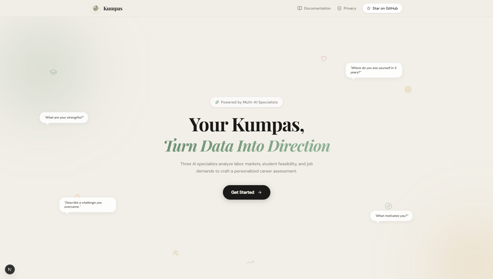
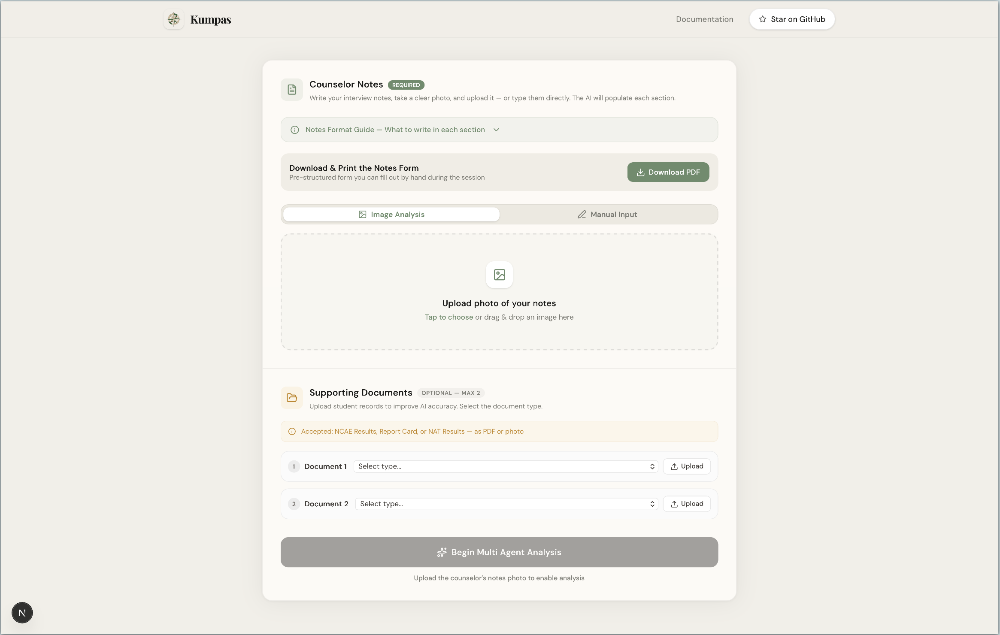

<div align="center">
  

  # Kumpas
  **A Multi-Agent Career Assessment System Powered by Student Academic Records**

  [](https://nextjs.org/)
  [](https://ai.google.dev/)
  [](https://vercel.com/)
</div>

---

## Overview

Kumpas generates structured career assessment reports from a student's existing academic data — NCAE results, NAT scores, and counselor notes — using a five-AI pipeline built on Next.js and the Gemini API.

By processing this combined data through a multi-agent architecture, Kumpas supports **UN Sustainable Development Goal 8 (SDG 8)** — promoting decent work and inclusive economic growth through data-backed career guidance.

Built for guidance counselors. Paid for by schools. Free for students.

---

## Application Preview

### Landing Page

*The main entry point for guidance counselors.*

### Data Input Interface

*Upload interface for NCAE/NAT documents and counselor notes.*

---

## How It Works

### Input
Counselors upload three things:
- **NCAE results** — image (JPEG, PNG, PDF)
- **Report card or NAT scores** — image (JPEG, PNG, PDF)
- **Counselor notes** — typed freehand or uploaded as an image

### Pipeline

**1. Vision Layer**
Gemini's native multimodal vision reads and parses all uploaded documents — extracting scores, percentiles, and qualitative notes — and structures everything into a unified format for the downstream agents.

**2. Core Analysis — 3 Agents in Parallel**

| Agent | Framework | Question Answered |
|---|---|---|
| Labor Analyst | LMI (Labor Market Information) | Is this career viable in the Philippine job market? |
| Feasibility Analyst | SCCT (Social Cognitive Career Theory) | Can this student realistically get there? |
| Job Demand Analyst | JD-R (Job Demands-Resources Model) | Will this career burn them out? |

Each agent is independently prompted and grounded in its own framework and dataset.

**3. Adjacency Layer**
Synthesizes all three agent outputs and surfaces alternative career paths for the counselor to explore with the student.

**4. Output**
- Per-agent reports with key signals, interpretations, and supporting data
- Score breakdown by academic area
- Counselor note review panel
- One-click PDF summary export for the student

---

## Technology Stack

| Layer | Technology |
|---|---|
| Frontend & Backend | Next.js |
| AI & Vision | Gemini API (multimodal) |
| Deployment | Vercel |

No separate backend server. No OCR library. Vision and analysis are handled entirely through Gemini's multimodal API via Next.js API routes.

---

## Local Development

### Prerequisites
- Node.js 18 or higher
- Gemini API key

### Setup

**1. Clone the repository**
```bash
git clone https://github.com/your-org/kumpas.git
cd kumpas
```

**2. Install dependencies**
```bash
npm install
```

**3. Configure environment variables**

Create a `.env.local` file in the root directory:
```
GEMINI_API_KEY=your_api_key_here
```

**4. Run the development server**
```bash
npm run dev
```

Open [http://localhost:3000](http://localhost:3000).

---

## Validation

Kumpas's input structure and agent outputs have been reviewed and validated by guidance counselors at Cebu Institute of Technology – University (CIT-U).

---

## Business Model

- **B2B SaaS** — schools subscribe, counselors use it, students pay nothing
- **Pricing** — scaled by student enrollment
- **Cost per session** — ₱3.50 per student analysis run
- **Data partnerships** — anonymized career data shared with DOLE and CHED to inform national youth programs

### Market
- **SOM** — 50 private schools in Cebu (beachhead: CIT-U)
- **SAM** — 150 schools across Region 7
- **TAM** — 2,500 Senior High Schools nationwide

---

*Turning Data into Direction.*